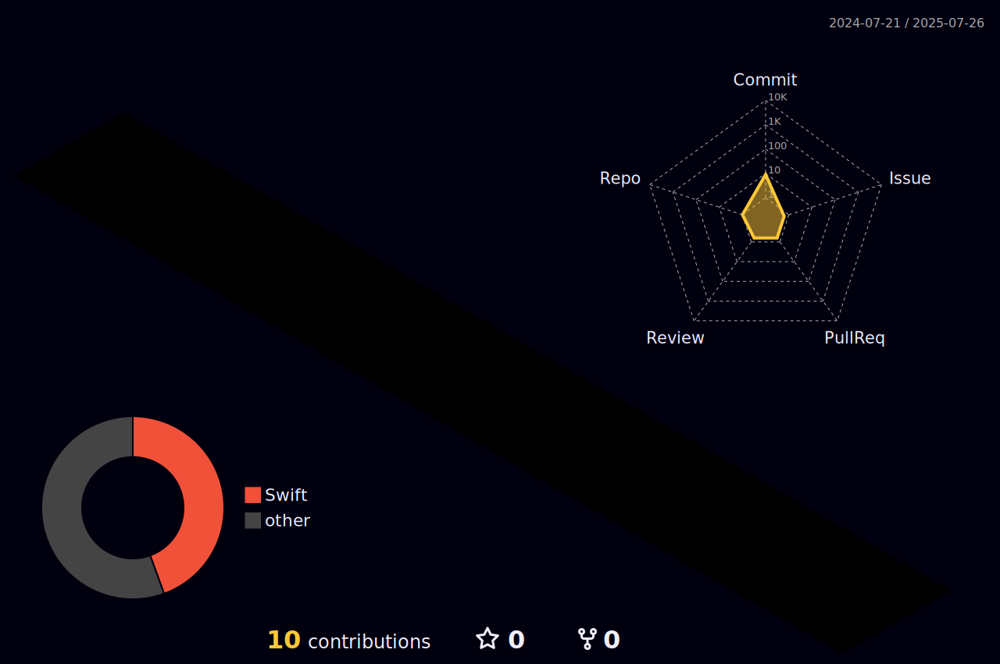

# 💫 About Me:
Junior iOS Developer with a Passion for Learning and Collaboration
As a junior iOS developer with six months of experience, I am a driven and dedicated individual who is always eager to learn and grow in my field. I possess a strong foundation in iOS development and am committed to staying up-to-date with the latest industry trends and technologies. I am a team player who is always willing to lend a helping hand and contribute to the success of the team.
If you are looking for a dedicated and collaborative junior iOS developer to join your team, I would be an excellent choice.

## 🌐 Socials:
  

# 💻 Tech Stack:
  	      
# 📊 GitHub Stats:
 

 

---

